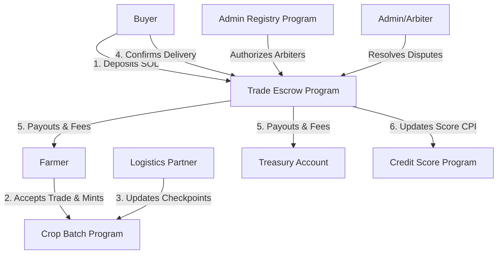

# CropChain Smart Contracts

CropChain is a blockchain-powered agricultural supply chain and micro-financing platform on Solana, built using the **Anchor Framework**. It allows Nigerian smallholder farmers to track agricultural batches, trade crops via secure escrows, build on-chain credit scores, and access micro-financing eligibility.

---

## 1. Program Architecture

The CropChain workspace consists of 4 core programs working together:



### 🔐 1. `admin_registry`
* **Purpose:** Modular program authority control.
* **Key Features:**
  * One-time state initialization of `ProgramConfig` (`CONFIG_SEED`) which stores the ecological `master_authority`.
  * Allows the master authority to dynamically register (`add_admin`) and revoke (`revoke_admin`) arbiters/admins (`ADMIN_SEED`).
  * Other programs read this registry to authorize operations.

### 🌾 2. `crop-batch`
* **Purpose:** Supply chain tracking.
* **Key Features:**
  * Mints new batches (`BatchState`) with status checking (`Active`, `InTransit`, `Sold`).
  * Manages checkpoint logs tracking location, condition, and timestamps.
  * Allows registering authorized logistics partners to append checkpoints and log transportation updates.

### 💳 3. `credit_score`
* **Purpose:** micro-financing eligibility analysis.
* **Key Features:**
  * One-time state initialization of `CreditConfig` (`CONFIG_SEED`) which stores the ecological `master_authority` and the trusted `trade_escrow` program ID dynamically (preventing hardcoded program IDs).
  * Evaluates farmer trade transaction history and updates scoring.
  * Dynamically computes and logs farmer credit score and lending eligibility status (`Eligible` vs `Ineligible`).
  * Enforces secure dual-authorization (updates are permitted only if signed by the farmer directly or via an authorized CPI from the verified `trade_escrow` program).

### 🤝 4. `trade_escrow`
* **Purpose:** Buyer-Seller trade agreement and payment security.
* **Key Features:**
  * **`create_trade`**: Buyer creates a trade escrow, depositing SOL into the vault PDA.
  * **`accept_trade`**: Farmer accepts the trade, transitioning status to `Active` and logging timestamps.
  * **`confirm_delivery`**: Buyer confirms delivery, releasing funds (1% to treasury, 99% to farmer) and automatically triggering a credit score increase for the farmer via CPI.
  * **`cancel_trade`**: Buyer cancels a pending trade, reclaiming the escrow deposit and closing the trade account to reclaim rent.
  * **`raise_dispute`**: Buyer or Farmer locks funds and flags status as `Disputed`.
  * **`resolve_dispute`**: Authorized arbiters from `admin_registry` resolve disputes, routing vault funds to either the buyer (refund) or farmer.

---

## 2. Setup & Installation

### Prerequisites
* Rust & Cargo (latest stable)
* Solana CLI tools
* Node.js & Yarn
* Anchor CLI (`^1.0.2`)

### Install Dependencies
From the `smart-contract` directory:
```bash
yarn install
```

### Environment Configuration
Create a `.env` file in the `smart-contract` directory:
```env
MASTER_AUTHORITY="3sDe7RaEhKvGhby6krh6N3jDT8V9E6P6bdZfibeLRrsy"
```

---

## 3. Testing & Execution

### Running Unit Tests (Rust)
Runs all 37 on-chain unit tests checking state sizes, seed derivations, mathematical bounds, and serialization round-trips:
```bash
cargo test
```

### Running Integration Tests (TypeScript / Mocha)
Launches a local validator, compiles all programs, executes migrations, and runs all 28 automated integration scenarios:
```bash
anchor test --validator legacy
```

### Deployment & Migrations
To deploy and initialize the ecosystem (devnet/mainnet):
```bash
anchor deploy
anchor migrate
```
The migration script ([migrations/deploy.ts](file:///home/HX/projects/CropChain/smart-contract/migrations/deploy.ts)) reads the `MASTER_AUTHORITY` public key from `.env` and initializes the program config dynamically.
